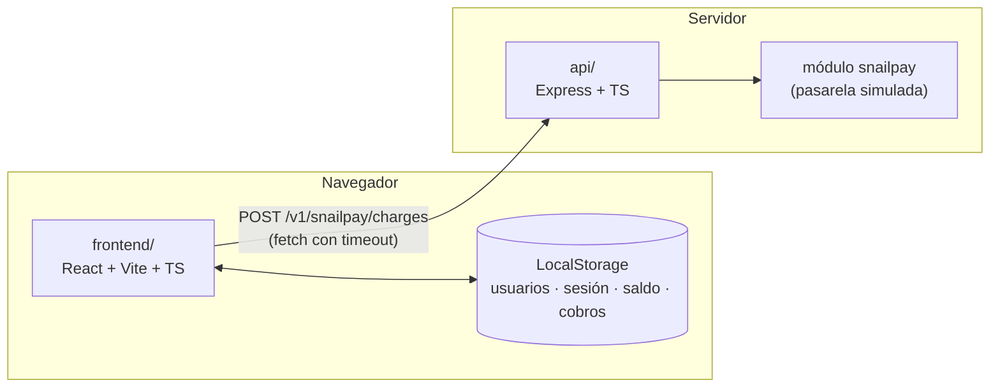

# Visión general

> **Audiencia:** quien revisa o continúa el proyecto.
> **Propósito:** las piezas del sistema, cómo se comunican y dónde vive cada dato.
> **Estado:** diseño propuesto, pendiente de implementar. Las decisiones están en los [ADR](adr/README.md).

## Piezas



| Pieza | Responsabilidad | No hace |
|---|---|---|
| `frontend/` | Registro y login locales, sesión, dashboard, gráficas, formulario de recarga y aplicar el saldo cuando un cobro es aprobado. | No decide si un cobro se aprueba. |
| LocalStorage | Guarda usuarios (con la contraseña como hash), la sesión, el saldo y el historial de cobros. | No es una fuente confiable: el usuario puede editarlo (ver [límites](#límites-conocidos-del-diseño)). |
| `api/` + SnailPay | Valida la solicitud de cobro y responde según el escenario (aprobado, rechazado, error del sistema). | No guarda estado, no toca servicios reales, no conoce el saldo. |

**Por qué el backend solo tiene SnailPay.** El alcance pide que el registro, la sesión y el saldo sean una simulación local en LocalStorage, y que SnailPay se construya en Express. Poner la autenticación en el servidor contradiría el requisito de simulación local y agregaría una capa que no se evalúa. La propuesta de cómo evolucionaría con una base de datos está en [propuesta de base de datos](../07-entrega/propuesta-base-de-datos.md).

## Flujo principal: recarga de saldo

```mermaid
sequenceDiagram
  actor U as Usuario
  participant F as frontend
  participant L as LocalStorage
  participant S as SnailPay (api)

  U->>F: Captura tarjeta, vencimiento, CVV, nombre y monto
  F->>F: Valida con el esquema (zod)
  F->>S: POST /v1/snailpay/charges + payer_id, payer_email
  alt aprobado (201, status=approved)
    S-->>F: cobro con authorization_code
    F->>L: guarda el cobro y suma el monto al saldo (una sola vez por id)
    F-->>U: "Recarga aprobada" + saldo actualizado
  else rechazado (402/422, status=rejected)
    S-->>F: cobro con status_detail
    F->>L: guarda el cobro; el saldo NO cambia
    F-->>U: mensaje según status_detail
  else error del sistema (503, status=error)
    S-->>F: cobro con status_detail=service_unavailable
    F-->>U: "Servicio no disponible, intenta más tarde"; saldo NO cambia
  else timeout del cliente
    F-->>U: "No pudimos confirmar la recarga"; saldo NO cambia
  end
```

**Regla contra falsos éxitos.** El frontend solo suma saldo si se cumplen las cinco condiciones:
1. El HTTP es 201.
2. `status` es `approved`.
3. Hay un `authorization_code`.
4. `transaction_amount` coincide con el monto que se pidió.
5. El `id` del cobro no se había aplicado antes.

Cualquier otra combinación, incluida una respuesta que no se puede interpretar, se trata como no aprobada. Detalle en el [ADR 0004](adr/0004-contrato-de-snailpay.md).

## Dónde vive cada dato

| Dato | Dónde | Detalle |
|---|---|---|
| Usuario (nombre, correo, hash de la contraseña) | LocalStorage | [Autenticación y sesión](autenticacion-y-sesion.md) |
| Sesión | LocalStorage | [Autenticación y sesión](autenticacion-y-sesion.md) |
| Saldo (en centavos) e historial de cobros | LocalStorage | [Persistencia en LocalStorage](persistencia-localstorage.md) |
| Datos de las gráficas | Generados al vuelo, de forma determinista | [ADR 0007](adr/0007-datos-simulados-de-graficas.md) |
| Escenarios de SnailPay | Código de `api/`, sin estado | [Escenarios](../03-snailpay/escenarios.md) |

## Límites conocidos del diseño

Son deliberados porque el alcance es una simulación, y cada uno tiene su alternativa de producción documentada:

- **El saldo vive en el navegador.** Cualquier persona puede editar LocalStorage y cambiarlo. En producción, el saldo sería un libro contable en el servidor y SnailPay le notificaría con un webhook firmado.
- **SnailPay no autentica al cliente.** Cualquiera puede llamar al endpoint. En producción, las llamadas llevarían una llave de API del comercio y el cobro se tokenizaría en el navegador.
- **El número de tarjeta y el CVV viajan en la respuesta y se guardan en el navegador** porque el alcance lo exige. En un sistema real esto contradice PCI DSS ([ADR 0006](adr/0006-datos-de-tarjeta-en-respuesta-y-almacenamiento.md)).
