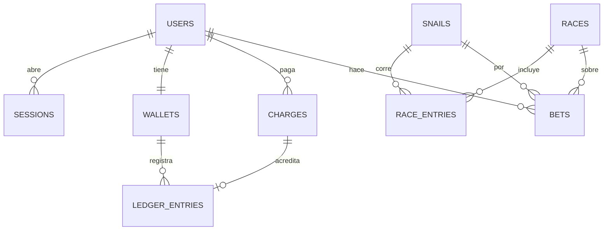

# Propuesta de base de datos

> **Audiencia:** quien evalúa el adicional AD-02.
> **Propósito:** cómo pasaría la aplicación de LocalStorage a una base de datos. **No se implementa.**
> **Estado:** borrador. Se revisa al terminar el desarrollo para que coincida con el modelo real.

## Tecnología

**PostgreSQL** (por ejemplo, Neon en su modo serverless, que ya se usa en el ecosistema):
- un saldo es un dato transaccional y necesita ACID;
- las relaciones entre usuario, cobros y apuestas son claras;
- `NUMERIC` o enteros en centavos evitan los errores de redondeo.

El acceso desde Express iría con un query builder tipado (Kysely o Drizzle) y migraciones versionadas.

## Qué se almacena y cómo se relaciona

| Tabla | Campos clave | Notas |
|---|---|---|
| `users` | `id` (uuid), `full_name`, `email` (único, normalizado), `password_hash` (Argon2id), `created_at` | El hash se calcula en el servidor |
| `sessions` | `id`, `user_id`, `expires_at`, `revoked_at` | Se identifica por una cookie `HttpOnly` |
| `wallets` | `user_id` (PK), `balance_cents` | El saldo es una **proyección** del libro |
| `ledger_entries` | `id`, `wallet_id`, `amount_cents` (±), `kind` (`recharge`, `bet`, `payout`), `charge_id`, `created_at` | Libro contable inmutable: el saldo es la suma de sus movimientos |
| `charges` | `id`, `user_id`, `status`, `status_detail`, `amount_cents`, `authorization_code`, `reference`, `card_brand`, `card_last_four`, `idempotency_key` (único), `created_at` | **Sin PAN completo ni CVV** (ADR 0006) |
| `snails` | `id`, `name` | Catálogo |
| `races` / `race_entries` | `id`, `scheduled_at`, `winner_snail_id` / `race_id`, `snail_id`, `position` | Carreras reales en lugar de simuladas |
| `bets` | `id`, `user_id`, `race_id`, `snail_id`, `amount_cents`, `result` | Alimenta el donut |

## Cambios necesarios

**Backend**:
- módulos nuevos `auth` (registro, login, sesión), `wallet` (saldo y libro) y `races`;
- SnailPay notificaría el resultado por un **webhook firmado** y el backend acreditaría el saldo en una transacción (cobro + movimiento + saldo), con `idempotency_key` para no acreditar dos veces;
- el estado deja de vivir en el cliente.

**Frontend**:
- los stores dejan de leer LocalStorage y consultan el API;
- la sesión pasa a una cookie `HttpOnly`;
- el formulario de tarjeta se tokeniza con el SDK de la pasarela;
- LocalStorage queda solo para preferencias (tema).
