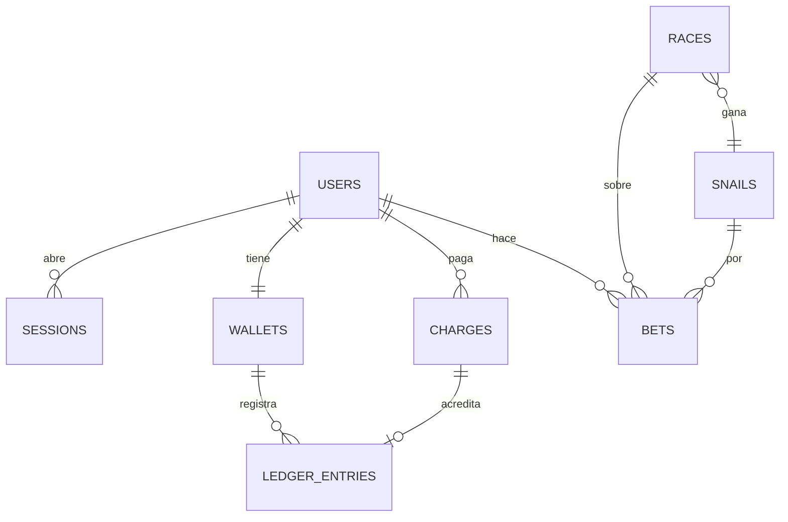

# Propuesta de base de datos

> **Audiencia:** quien evalúa el adicional AD-02.
> **Propósito:** cómo pasaría la aplicación de LocalStorage a una base de datos. **No se implementa.**
> **Estado:** final (2026-09-28). Parte del modelo que hoy vive en `frontend/src/storage/slots.ts`.

## Tecnología

**PostgreSQL**, en modo serverless (Neon) para que encaje con el API en AWS Lambda:

- Un saldo es un dato transaccional: necesita ACID, restricciones y bloqueos de fila.
- Las relaciones (usuario → cobros → movimientos) son relacionales por naturaleza.
- Los montos se guardan como **enteros en centavos**, igual que hoy en el frontend.

Desde Express: un query builder tipado (**Kysely**) con migraciones versionadas en el repo, y el driver serverless de Neon (conexiones por HTTP/WebSocket) para no agotar conexiones con cada invocación de Lambda.

## Qué se almacena y cómo se relaciona

| Tabla            | Hoy vive en                     | Campos clave                                                                                                                                                      | Restricciones que importan                                                                      |
| ---------------- | ------------------------------- | ----------------------------------------------------------------------------------------------------------------------------------------------------------------- | ----------------------------------------------------------------------------------------------- |
| `users`          | `snail-race:v1:users`           | `id` uuid, `full_name`, `email`, `password_hash`, `created_at`                                                                                                    | `email` único y normalizado; hash **Argon2id** calculado en el servidor                         |
| `sessions`       | `snail-race:v1:session`         | `id`, `user_id`, `expires_at`, `revoked_at`                                                                                                                       | Se identifica por una cookie `HttpOnly` + `Secure` + `SameSite`                                 |
| `wallets`        | `snail-race:v1:wallets`         | `user_id` (PK), `balance_cents`                                                                                                                                   | `CHECK (balance_cents >= 0)`; es una proyección del libro                                       |
| `ledger_entries` | — (hoy solo `appliedChargeIds`) | `id`, `wallet_id`, `amount_cents` (±), `kind` (`recharge`, `bet`, `payout`), `charge_id`, `created_at`                                                            | Inmutable; `charge_id` **único**: un cobro no puede acreditarse dos veces                       |
| `charges`        | `snail-race:v1:charges`         | `id` (el de SnailPay), `user_id`, `status`, `status_detail`, `amount_cents`, `authorization_code`, `reference`, `card_last_four`, `idempotency_key`, `created_at` | **Sin PAN completo ni CVV** (ADR 0006); `idempotency_key` único; índice `(user_id, created_at)` |
| `snails`         | constante `SNAILS`              | `id`, `name`                                                                                                                                                      | Catálogo de 6                                                                                   |
| `races`          | generado (ADR 0007)             | `id`, `race_date`, `number`, `winner_snail_id`                                                                                                                    | Único `(race_date, number)`; `number` entre 1 y 6                                               |
| `bets`           | generado (ADR 0007)             | `id`, `user_id`, `race_id`, `snail_id`, `amount_cents`, `result`                                                                                                  | Una apuesta por usuario y carrera; alimenta la dona                                             |

## Cómo se acredita una recarga

En una sola transacción del servidor, que sustituye a la regla contra falsos éxitos que hoy aplica el navegador:

1. El frontend pide el cobro al **backend** (no a SnailPay directo), con un `Idempotency-Key`.
2. El backend llama a SnailPay y guarda el cobro en `charges`, con el resultado que sea.
3. Solo si el resultado es `approved` y el monto coincide: inserta el movimiento en `ledger_entries` y hace `UPDATE wallets SET balance_cents = balance_cents + $1` sobre la fila bloqueada (`SELECT … FOR UPDATE`).
4. Un reintento con la misma llave, o una respuesta repetida, choca con las restricciones únicas y no acredita dos veces.

## Cambios necesarios

**Backend:** módulos nuevos `auth` (registro, login, sesión), `wallet` (saldo y libro) y `races`. SnailPay pasa a ser un adapter del backend. El saldo, la sesión y las contraseñas dejan de vivir en el cliente, y el hash se hace en el servidor.

**Frontend:**

- Los stores (`session`, `wallet`) dejan de leer `storage/` y consultan el API mediante sus services.
- La sesión viaja en una cookie, así que desaparece el slot de sesión.
- El formulario de tarjeta se tokeniza con el SDK de la pasarela, de modo que el PAN y el CVV no pasan por nuestro backend.
- LocalStorage queda solo para preferencias, como el tema.

Los datos de LocalStorage no se migran: son de una simulación local.
